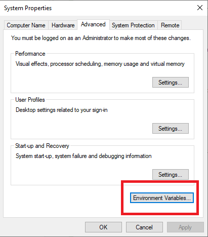

# ShiftConvolveFFTW

`ShiftConvolve` is a R package which uses exponential shifting and the Fast Fourier Transformations (FFT) to compute the (right) tail of the Poisson Binomial Distribution. 
This package makes use of the `Fastest Fourier Transform in the West` ([FFTW](http://www.fftw.org/)) library to perform the necessary DFT and Inverse DFT computations.

For the `ShiftConvolve` implementation which uses [minFFT](https://github.com/aimukhin/minfft) to perform the Fourier Transformations please go to [https://github.com/andrew12678/ShiftConvolve](https://github.com/andrew12678/ShiftConvolve).

In the interest of speed we all significant computational aspects of our procedure are executed by code written in C and the R code mainly acts as a wrapper around that compiled C code.

We have successfully installed `ShiftConvolveFFTW` on `Windows 10: Professional Version 1909`, `macOS: Mojave 10.14.6/Catalina 10.15.4` and `Linux: Ubuntu 18.04/Manjaro 19.02 KDE Plasma`. A full installation guide will be provided below for all 3 Operating Systems.

`ShiftConvolveFFTW` has also been installed on both `AMD` and `Intel` CPU systems. Specifically, a  `Intel Core i7 MacMini with 32GB of RAM`, `AMD Ryzen 5 2600 with 16GB of RAM` and a `Macbook Pro i7 with 16GB of RAM` 

## Dependencies

As eluded to above, `FFTW` will be a necessary dependency. 

### Linux

This package was originally compiled in an `Ubuntu 18.04` Linux operating system using `R 3.5.1` and `FFTW 3.3.5` but was later recompiled (without any modification of the configurations) in a `Manjaro 19.02 KDE Plasma` Linux operating system with inbuilt `FFTW 3.3.8` and `R 3.6.3`. 
Since the `FFTW` came along with the `Manjaro` installation, we will only outline installations on the `Ubuntu` and `macOS` system which does not automatically install `FFTW`.

For `Ubuntu` the steps included:

```bash
wget http://fftw.org/fftw-3.3.5.tar.gz
tar -xzf fftw-3.3.5.tar.gz
cd fftw-3.3.5
./configure --enable-shared
make
sudo make install
```

Since the `Manjaro` distribution came with `FFTW 3.3.8`, later versions of `FFTW` should be able to be installed as well.

### macOS

FFTW should be first installed in the same manner as the Linux distributions with the `macOS` terminal. For emphasis we repeat it below.

```bash
wget http://fftw.org/fftw-3.3.5.tar.gz
tar -xzf fftw-3.3.5.tar.gz
cd fftw-3.3.5
./configure --enable-shared
make
sudo make install
```

To use `wget`, the user may have to install [Homebrew](https://brew.sh/), which can be installed with the following command. 

```bash
/bin/bash -c "$(curl -fsSL https://raw.githubusercontent.com/Homebrew/install/master/install.sh)"
```

To avoid a further `pkg-config` error later down the track, we shall install it with `brew`

```bash
brew install pkg-config
```

If the above throws an error then it should prompt you make the following 2 changes and then try the installation again.

```bash
sudo chown -R $(whoami) /usr/local/lib/pkgconfig /usr/local/share/info
chmod u+w /usr/local/lib/pkgconfig /usr/local/share/info
brew install pkg-config
```

### Windows

Before installation, get to see if you have `Rtools` installed on your system already (via `Add or remove programs`). If not we wish to download and install here: [https://cran.r-project.org/bin/windows/Rtools/](https://cran.r-project.org/bin/windows/Rtools/)

We will not be installing `FFTW` in the conventional way for `Windows`, instead we will use the precompiled binary called `fftw-3.3.5-dll64.zip` found here: [http://www.fftw.org/install/windows.html](http://www.fftw.org/install/windows.html).

After unzipping `fftw-3.3.5-dll64.zip`, we want to copy the files `fftw3.h` and `libfftw3-3.dll` to a directory `C:\fftw` (to create this directory simply open any Windows `File Explorer`, click `This PC` on the left panel and enter `Local Disk (C:) and just make a new folder called fftw`)

 

Then in the `Windows` search bar we want to type `environment` and then click: `Edit the system environment variables`.


We then want to click `Environment Variables` in the following pop-up:



Then under `System Variables` click `New` to add a variable for `LIB_FFTW` with value `C:\fftw`:


Then back to `System Variables` we want to find the entry called `Path`, click once on it to highlight it and then click `Edit`:


Here we want to make sure the `C:\Rtools\bin` and `C:\fftw` are both entries are in Path, otherwise we add then by clicking `New`:


That should conclude all the installation of `FFTW` dependencies on Windows. 

Alternatively, one could attempt to build `FFTW` from source using `MinGW` as outlined on [http://www.fftw.org/install/windows.html](http://www.fftw.org/install/windows.html) using the commands in the `MinGW` terminal in the directory of the zip file downloaded earlier:

````bash
./configure --with-our-malloc16 --with-windows-f77-mangling --enable-shared --disable-static --enable-threads --with-combined-threads --enable-portable-binary --enable-sse2 --with-incoming-stack-boundary=2
make
make install
````

However, we have not (and do not intend to) try this.

## Installation

The most simple installation involves simply cloning this repository and installing `ShiftConvolveFFTW` from source. 

```bash
git clone https://github.com/andrew12678/ShiftConvolveFFTW.git
cd ShiftConvolveFFTW
# After opening up R or Rstudio in the ShiftConvolveFFTW directory
install.packages('ShiftConvolvePoibin_1.16.0.tar.gz', repos = NULL, type="source")
```

An alternative installation procedure involves cloning the repository, creating a `RStudio` project in the `ShiftConvolvePoibin` folder and then building. 

## Examples

An simple example with the uniform distribution

```R
library(ShiftConvolvePoibin)
set.seed(18)
n = 10000
p = runif(n)
s0 = 5200
shiftpval(p, s0)	# compute the p-value, or right tail at s0
shiftpval(1-p, n-s0)	# compute the p-value, or left tail at s0
```
